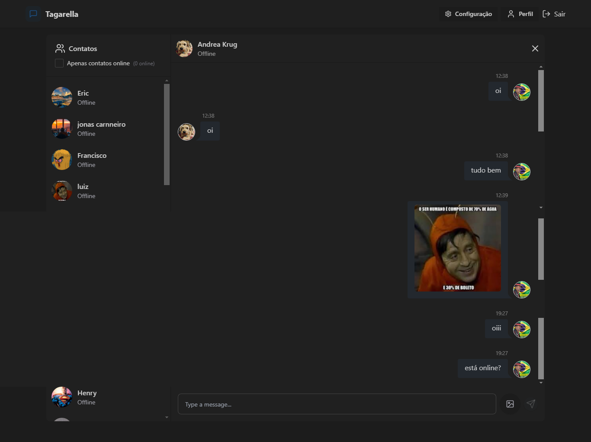

# Tagarella ChatApp

Tagarella ChatApp é um aplicativo de chat em tempo real, desenvolvido com ReactJS, Tailwind CSS, JavaScript, MongoDB, Cloudinary, Axios e Socket.io. Com ele, você pode se cadastrar rapidamente e conversar com outras pessoas que estejam online, além de compartilhar fotos diretamente pelo chat.
[Link para o projeto](https://tagarella-chat-app.onrender.com/login)

## Tecnologias Utilizadas

- **ReactJS** - Para a interface do usuário
- **Tailwind CSS** - Para estilização rápida e responsiva
- **JavaScript** - Linguagem principal do projeto
- **MongoDB** - Banco de dados NoSQL para armazenar informações dos usuários e mensagens
- **Cloudinary** - Para upload e armazenamento de imagens
- **Axios** - Para requisições HTTP entre frontend e backend
- **Socket.io** - Para comunicação em tempo real entre os usuários

## Funcionalidades

- Cadastro e login de usuários
- Envio de mensagens em tempo real
- Lista de usuários online
- Compartilhamento de imagens no chat
- Interface moderna e responsiva

## Como Executar o Projeto

### 1. Clone o repositório

```bash
git clone https://github.com/seu-usuario/tagarella-chatapp.git
cd tagarella-chatapp
```

### 2. Instale as dependências

```bash
npm install
```

### 3. Configure as variáveis de ambiente

Crie um arquivo `.env` na raiz do projeto e adicione as credenciais necessárias para conexão com o MongoDB, Cloudinary e outras APIs.

### 4. Inicie o servidor backend

```bash
npm run server
```

### 5. Inicie o frontend

```bash
npm start
```

## Contribuição

Se quiser contribuir para o projeto, siga os passos:

1. Fork este repositório
2. Crie uma nova branch (`git checkout -b minha-feature`)
3. Commit suas modificações (`git commit -m 'Adicionando uma nova funcionalidade'`)
4. Envie para o repositório (`git push origin minha-feature`)
5. Abra um Pull Request

## Licença

Este projeto está sob a licença MIT. Veja o arquivo [LICENSE](LICENSE) para mais detalhes.


